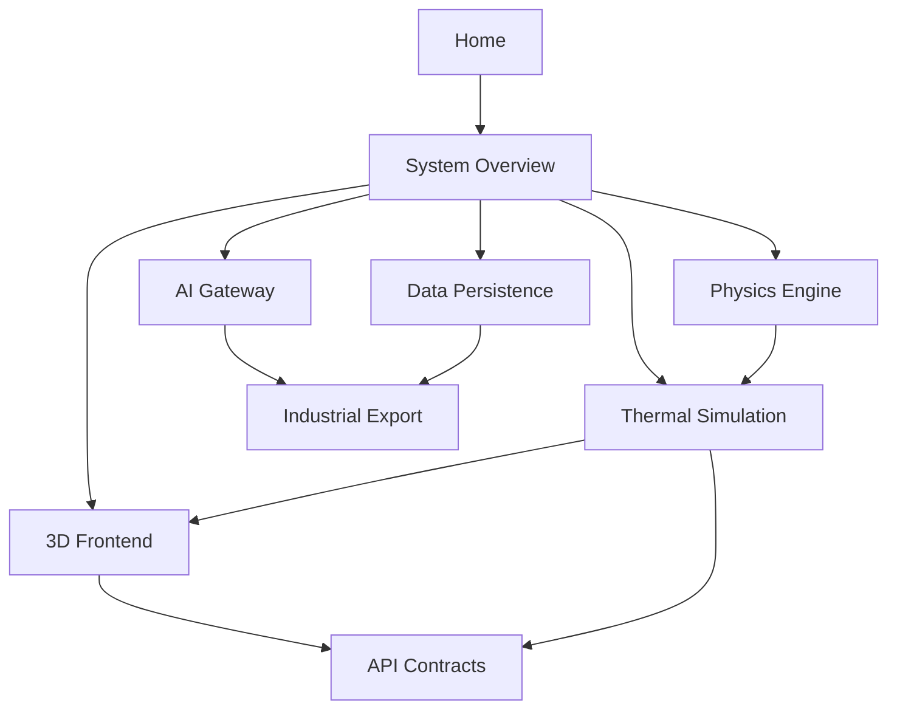

# GreenhouseOS 5.0 — Intellectual Property Knowledge Vault

> **Document classification:** Internal IP deposit reference  
> **Language:** English  
> **Version:** 5.0.0  
> **Generated for:** Proprietary software registration and technical due diligence  
> **Security posture:** Redacted — no credentials, deployment secrets, or production endpoints

---

## Navigation Map

This vault follows an [[Obsidian]]-style linked-note structure. Each note is self-contained yet cross-references related concepts via wikilinks.

### Core Documents

| Note | Purpose |
|------|---------|
| [[00-IP-Deposit-Cover]] | Title page, legal notice, redaction policy |
| [[01-Executive-Summary]] | High-level product vision and value pillars |
| [[02-System-Overview]] | Monorepo topology and technology stack |
| [[03-Physics-Engine]] | FAO-56, VPD, DLI — agronomic calculation core |
| [[04-Thermal-Simulation]] | Energy balance, equipment models, heatmaps |
| [[05-3D-Frontend]] | React Three Fiber viewport, shaders, No-Form UX |
| [[06-AI-Gateway]] | Multi-provider AI copilot and local optimizer |
| [[07-Data-Persistence]] | Supabase schema, RLS, greenhouse CRUD |
| [[08-Industrial-Export]] | Priva / Ridder / Hoogendoorn interoperability |
| [[09-API-Contracts]] | REST and WebSocket public contracts (redacted) |
| [[10-Security-Redaction-Policy]] | What is excluded from this vault |
| [[11-Module-Index]] | Complete module registry with file paths |
| [[12-IP-Declaration]] | Ownership statement and originality claims |

### Concept Graph

---

## Software Identity

| Field | Value |
|-------|-------|
| **Product name** | GreenhouseOS 5.0 |
| **Category** | Enterprise 3D Virtual Twin & SaaS for greenhouse design |
| **License** | Business Source License 1.1 (BUSL-1.1) |
| **Change date** | 2029-08-03 → Apache 2.0 |
| **Source modules** | 113 TypeScript/Python files (~15,200 LOC) |
| **Primary languages** | Python 3.11+, TypeScript (strict) |

---

## Related External References

- FAO Irrigation and Drainage Paper 56 (Penman-Monteith ET₀)
- ASHRAE Handbook — Fundamentals (psychrometrics)
- Industrial climate computer tag conventions (Priva, Ridder, Hoogendoorn)

---

*This vault is intended for IP deposit, investor technical annexes, and internal architecture review. It deliberately omits executable secrets. See [[10-Security-Redaction-Policy]].*
